# Discord-Graph-Bot

Discord bot built using the [Java Discord API](https://github.com/DV8FromTheWorld/JDA) that provides help with algorithms or graph related questions, that has been extended to also answer other questions using the [Wikipedia](https://en.wikipedia.org/wiki/Special:ApiSandbox#) and [Stackexchange](https://api.stackexchange.com/docs) APIs.

## Usage

All commands return a human readable version of the `Topic` object (see diagram below), which contains:

- article title
- content
- read more link

The cumulative length of the items above does not exceed 2000 characters (Discord's message limit for non-nitro accounts).

### Supported commands

The supported commands are the following:

- `/search-wiki [query]` searches Wikipedia for the user inputted query and replies to the message
- `/search-stack [query] [source]` searches Stackexchange pages for the user inputted query and replies to the message

### Command input

Commands and their parameters support auto-complete features by pressing `TAB` and the order of the parameters is irrelevant. A menu shows up when choosing the `source` parameter for the `/search-stack` command that can be accessed both by mouse and keyboard input.

Upon sending the command, the bot will immediately reply to your message and display the `... Graph Helper is thinking` status, meaning that the command has started to process. Depending on the arguments, it may take up to a second for the bot to properly answer. Once the bot replied to the command, the two reactions below the message (◀, ▶) let the user cycle between the search results. Once pressed, the user reaction is deleted and the message is edited to show the new search result.

### Sample replies

```text
/search-stack query:binary trees source:stackoverflow

👉  B trees vs binary trees
🔎  Read more at: https://stackoverflow.com/questions/6211118
📃  Page 2/30 
```

```text
/search-wiki query:graph vertex

👉  Vertex (graph theory)
In mathematics, and more specifically in graph theory, a vertex (plural vertices) or node is the fundamental unit of which graphs are formed: an undirected graph consists of a set of vertices and a set of edges (unordered pairs of vertices), while a directed graph consists of a set of vertices and a set of arcs (ordered pairs of vertices). In a diagram of a graph, a vertex is usually represented by a circle with a label, and an edge is represented by a line or arrow extending from one vertex to another.
From the point of view of graph theory, vertices are treated as featureless and indivisible objects, although they may have additional structure depending on the application from which the graph arises; for instance, a semantic network is a graph in which the vertices represent concepts or classes of objects.
The two vertices forming an edge are said to be the endpoints of this edge, and the edge is said to be incident to the vertices. A vertex w is said to be adjacent to another vertex v if the graph contains an edge (v,w). The neighborhood of a vertex v is an induced subgraph of the graph, formed by all vertices adjacent to v.
🔎  Read more at: https://en.wikipedia.org/?curid=638899
📃  Page 1/5
```

## REST requests

This bot also supports requests that filter the data from the APIs mentioned above:

| Type | Endpoint      | Purpose                              | Parameters                                                                                            |
| ---- | ------------- | ------------------------------------ | ----------------------------------------------------------------------------------------------------- |
| GET  | /search/wiki  | Readonly access to search result     | q: query to search for<br>index: item index to retrieve                                               |
| POST | /search/wiki  | Non readonly access to search result | q: query to search for<br>index: item index to retrieve                                               |
| GET  | /search/stack | Readonly access to search result     | q: query to search for<br>index: item index to retrieve<br>source: where to retrieve information from |
| POST | /search/stack | Non readonly access to search result | q: query to search for<br>index: item index to retrieve<br>source: where to retrieve information from |

Source is one of the following: "stackoverflow", "askubuntu", "serverfault", "superuser", "math", "apple", "cstheory".

## Behind the scenes

### Database

A mysql database is used in order to cache results from the API requests (otherwise the caller quota will be met, or the requests will return status 429). When a user executes a command, the database is queried first, and then the API calls are made. The database uses 3 tables in order to store data:

- messages: containing data about user message IDs and the current index of the search
- articles: containing the ID, title and content of the requested page
- user_prompts: containing the user prompt, source and relevant title

### Slash commands

All user commands use the new Discord slash commands. These are easier to use for both the end user and the developer, compared to regular messages. The API provides automatic parsing, range checks, optional arguments and warns the user whenever the arguments passed are invalid, such that no errored commands reach the backend.

## Setup

- Create your bot at [https://discord.com/developers/applications](https://discord.com/developers/applications)
- Copy its token from [https://discord.com/developers/applications/YOUR_BOT_ID/bot](https://discord.com/developers/applications/YOUR_BOT_ID/bot) into [example.config.env](src/resources/example.config.env)
- Add your database details in [example.config.env](src/resources/example.config.env)
- Create the database tables using [setup.sql](src/resources/setup.sql)
- Rename [example.config.env](src/resources/example.config.env) to [config.env](src/resources/config.env)

## Class diagram

<a href="diagram/diagram.svg">
  
</a>
