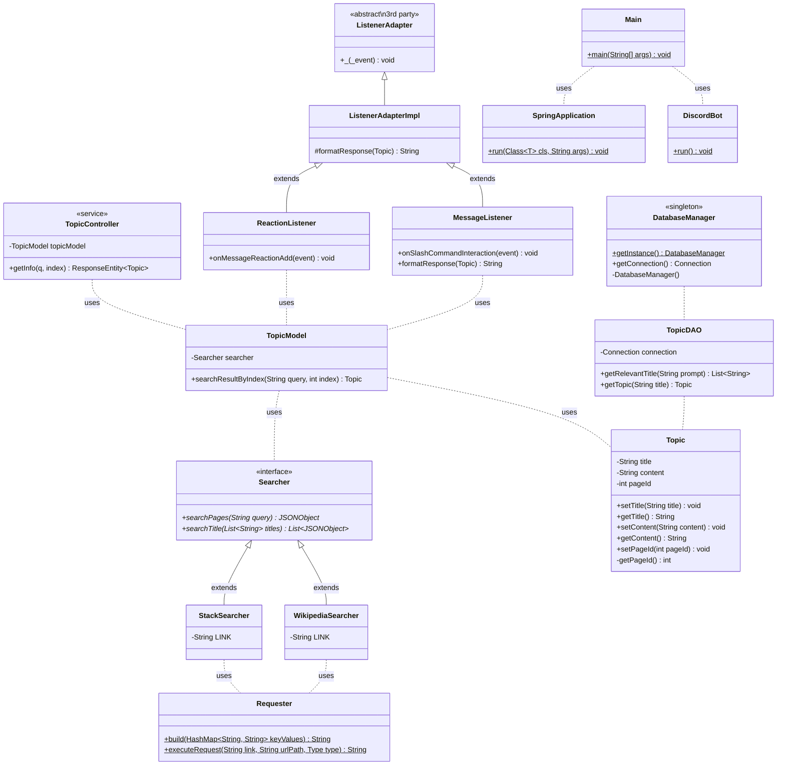

```mermaid
classDiagram
    class  Searcher {
        <<interface>>
        +searchPages(String query)* JSONObject
        +searchTitle(List~String~ titles)* List~JSONObject~
    }
    class WikipediaSearcher {
        -String LINK
    }
    class StackSearcher {
        -String LINK
    }


    class Topic {
        -String title
        -String content
        -int pageId

        +setTitle(String title) void
        +getTitle() String
        +setContent(String content) void
        +getContent() String
        +setPageId(int pageId) void
        -getPageId() int
    }
    class TopicModel {
        -Searcher searcher

        +searchResultByIndex(String query, int index) Topic
    }
    class TopicController {
        <<service>>
        -TopicModel topicModel

        +getInfo(q, index) ResponseEntity~Topic~
    }


    class Requester {
        +build(HashMap~String, String~ keyValues)$ String
        +executeRequest(String link, String urlPath, Type type)$ String
    }

    class ListenerAdapter {
        <<abstract\n3rd party>>
        +_(_event) void
    }
    class ListenerAdapterImpl {
        #formatResponse(Topic) String
    }
    class MessageListener {
        +onSlashCommandInteraction(event) void
        +formatResponse(Topic) String
    }
    class ReactionListener {
        +onMessageReactionAdd(event) void
    }

    class DatabaseManager {
        <<singleton>>
        +getInstance()$ DatabaseManager
        +getConnection() Connection
        -DatabaseManager()
    }
    class TopicDAO {
        -Connection connection
        +getRelevantTitle(String prompt) List~String~
        +getTopic(String title) Topic
    }

    class SpringApplication {
        +run(Class~T~ cls, String args)$ void
    }
    class DiscordBot {
        +run()$ void
    }
    class Main {
        +main(String[] args)$ void
    }


    DatabaseManager .. TopicDAO
    TopicDAO .. Topic

    ListenerAdapter <|-- ListenerAdapterImpl
    ListenerAdapterImpl <|-- MessageListener:extends
    ListenerAdapterImpl <|-- ReactionListener:extends
    MessageListener .. TopicModel:uses
    ReactionListener .. TopicModel:uses

    TopicController .. TopicModel:uses
    TopicModel .. Topic:uses
    TopicModel .. Searcher:uses

    Searcher <|-- WikipediaSearcher:extends
    Searcher <|-- StackSearcher:extends
    WikipediaSearcher .. Requester:uses
    StackSearcher .. Requester:uses

    Main .. SpringApplication:uses
    Main .. DiscordBot:uses
```
