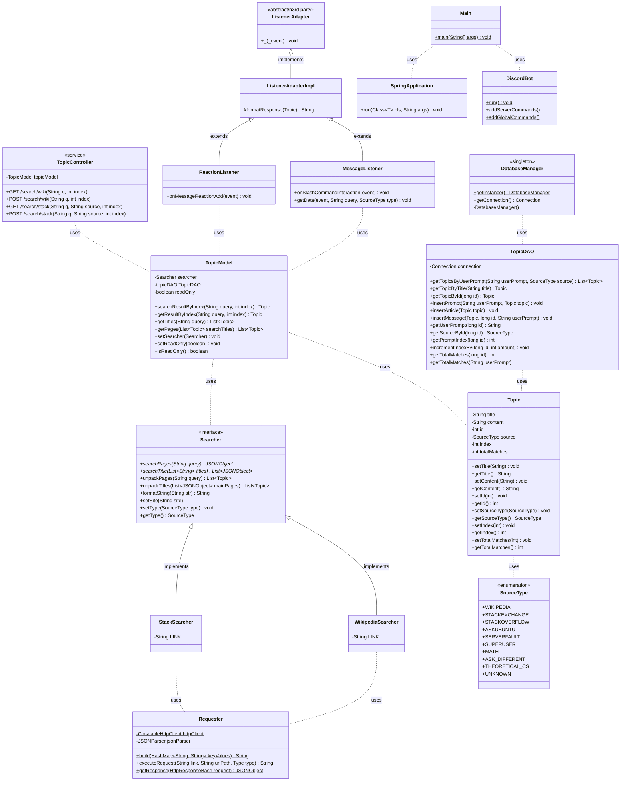

```mermaid
classDiagram
    class  Searcher {
        <<interface>>
        +searchPages(String query)* JSONObject
        +searchTitle(List~String~ titles)* List~JSONObject~
        +unpackPages(String query) List~Topic~
        +unpackTitles(List~JSONObject~ mainPages) List~Topic~
        +formatString(String str) String
        +setSite(String site)
        +setType(SourceType type) void
        +getType() SourceType
    }
    class WikipediaSearcher {
        -String LINK
    }
    class StackSearcher {
        -String LINK
    }


    class Topic {
        -String title
        -String content
        -int id
        -SourceType source
        -int index
        -int totalMatches

        +setTitle(String) void
        +getTitle() String
        +setContent(String) void
        +getContent() String
        +setId(int) void
        +getId() int
        +setSourceType(SourceType) void
        +getSourceType() SourceType
        +setIndex(int) void
        +getIndex() int
        +setTotalMatches(int) void
        +getTotalMatches() int
    }
    class TopicModel {
        -Searcher searcher
        -topicDAO TopicDAO
        -boolean readOnly

        +searchResultByIndex(String query, int index) Topic
        +getResultByIndex(String query, int index) Topic
        +getTitles(String query) List~Topic~
        +getPages(List~Topic~ searchTitles) List~Topic~
        +setSearcher(Searcher) void
        +setReadOnly(boolean) void
        +isReadOnly() boolean
    }
    class TopicController {
        <<service>>
        -TopicModel topicModel

        +GET /search/wiki(String q, int index)
        +POST /search/wiki(String q, int index)
        +GET /search/stack(String q, String source, int index)
        +POST /search/stack(String q, String source, int index)
    }


    class Requester {
        -CloseableHttpClient httpClient$
        -JSONParser jsonParser$

        +build(HashMap~String, String~ keyValues)$ String
        +executeRequest(String link, String urlPath, Type type)$ String
        +getResponse(HttpResponseBase request)$ JSONObject
    }

    class ListenerAdapter {
        <<abstract\n3rd party>>
        +_(_event) void
    }
    class ListenerAdapterImpl {
        #formatResponse(Topic) String
    }
    class MessageListener {
        +onSlashCommandInteraction(event) void
        +getData(event, String query, SourceType type) void
    }
    class ReactionListener {
        +onMessageReactionAdd(event) void
    }

    class DatabaseManager {
        <<singleton>>
        +getInstance()$ DatabaseManager
        +getConnection() Connection
        -DatabaseManager()
    }
    class TopicDAO {
        -Connection connection

        +getTopicsByUserPrompt(String userPrompt, SourceType source) List~Topic~
        +getTopicByTitle(String title) Topic
        +getTopicById(long id) Topic
        +insertPrompt(String userPrompt, Topic topic) void
        +insertArticle(Topic topic) void
        +insertMessage(Topic, long id, String userPrompt) void
        +getUserPrompt(long id) String
        +getSourceById(long id) SourceType
        +getPromptIndex(long id) int
        +incrementIndexBy(long id, int amount) void
        +getTotalMatches(long id) int
        +getTotalMatches(String userPrompt)
    }
    class SourceType {
        <<enumeration>>
        +WIKIPEDIA
        +STACKEXCHANGE
        +STACKOVERFLOW
        +ASKUBUNTU
        +SERVERFAULT
        +SUPERUSER
        +MATH
        +ASK_DIFFERENT
        +THEORETICAL_CS
        +UNKNOWN
    }

    class SpringApplication {
        +run(Class~T~ cls, String args)$ void
    }
    class DiscordBot {
        +run()$ void
        +addServerCommands()$
        +addGlobalCommands()$
    }
    class Main {
        +main(String[] args)$ void
    }


    DatabaseManager .. TopicDAO:uses
    TopicDAO .. Topic:uses
    Topic .. SourceType:uses

    ListenerAdapter <|-- ListenerAdapterImpl:implements
    ListenerAdapterImpl <|-- MessageListener:extends
    ListenerAdapterImpl <|-- ReactionListener:extends
    MessageListener .. TopicModel:uses
    ReactionListener .. TopicModel:uses

    TopicController .. TopicModel:uses
    TopicModel .. Topic:uses
    TopicModel .. Searcher:uses

    Searcher <|-- WikipediaSearcher:implements
    Searcher <|-- StackSearcher:implements
    WikipediaSearcher .. Requester:uses
    StackSearcher .. Requester:uses

    Main .. SpringApplication:uses
    Main .. DiscordBot:uses
```
